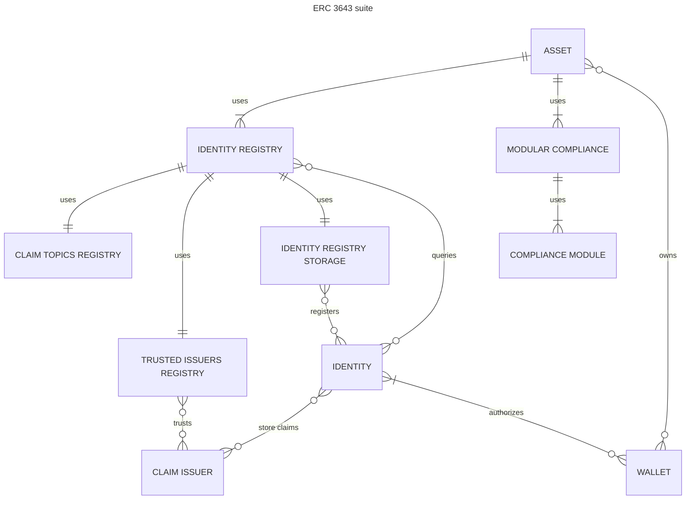

# Suite

An ERC3643 asset is backed by a set of contract. Though it is possible to implement a single to manage all aspects of
the standard, it is recommended to separate features as described bellow.

The implementation found in the [T-REX repository](https://github.com/TokenySolutions/T-REX) includes these contract as
part of the ERC3643 suite:

- **Asset** contract: usually, this is a contract representing an asset. It could me based on a ERC20, ERC721, ERC1155,
  or
  any other type of asset.
- **Identity Registry**: the asset contract will validate any transfer by verifying first if addresses part of the
  transfer
  (usually only the recipient) are registered and have required claims.
- **Identity Registry Storage**: the Identity Registry does not store identities, those are usually stored in another
  contract, the Identity Registry Storage. This allows to share the same registry of identities with multiple Identity
  Registry that have different claim requirements.
- **Claim Topics Registry**: the identity registry will require for its `isVerified` to return true that the specified
  identity has at least one valid claim of each claim topic.
- **Trusted Issuers Registry**: the identity registry will ensure that only claims issued by these trusted claim issuers
  are
  accepted.
- **Modular Compliance**: or any custom implementation of a Compliance contract. The Compliance contract uses its
  module`
  to validate the validity of a transfer given its rules.
- **Compliance Module**: modules implement specific requirements and rules for a compliance. They may require specific
  setup.
- **Claim Issuer**: though claim issuers are part of the ONCHAINID standard, ERC3643 assumes claim issuers follow
  the standard and implements the required `isClaimValid` method.

